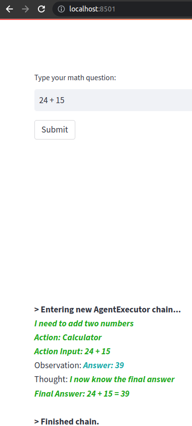

# streamlit-fastapi-langchain

Repository created as minimal reproducaible example for [this Stackoverflow question](https://stackoverflow.com/questions/76155032/connectionerror-on-multi-docker-app-streamlit-fastapi-deployed-on-heroku).

It is a multi-Docker application with a Streamlit frontend and a FastAPI backend [deployed on Heroku](https://morning-everglades-39854.herokuapp.com/).

## Roadmap

```
[] [Use human input as a tool](https://python.langchain.com/en/latest/modules/agents/tools/examples/human_tools.html)

```

## Set up

### Set `.env` file

```
cd streamlit-fastapi-langchain
cp .env.template .env
```

Set values of variables in `.env` accordingly

### (Optional) Build docker for backend

We can build dockers for backend and frontend separately or using `docker compose`. If building separately:

```
cd backend
docker build -t streamlit-fastapi-langchain-backend .
```

Note that because the `api.py` file is not automatically updated in the docker, whenever we modify this file, we need to build the docker again

## Run

### Build and run two dockers simultinously

```
cd streamlit-fastapi-langchain
docker compose --env-file .env up -d --build
```

### Go to `https:localhost:8501`

Example:


### (Optional) Run backend docker

```
docker run -p 8080:8080 streamlit-fastapi-langchain-backend

```

## References:

```
[0] https://testdriven.io/blog/fastapi-streamlit/
[1] [Tutorial](https://colab.research.google.com/drive/1pg5-lE0ns0ehc3TDANUd-Rr_FRkTgPZO?usp=sharing#scrollTo=YIZV3dpeS7oP)
[2] [Search Person API Parameters](https://docs.peopledatalabs.com/docs/input-parameters-person-search-api#size)
[3] [API Key (private)](https://dashboard.peopledatalabs.com/api-keys)
[4] [Person Schema](https://docs.peopledatalabs.com/docs/fields)
[5] [Use human input as a tool](https://python.langchain.com/en/latest/modules/agents/tools/examples/human_tools.html)
```
